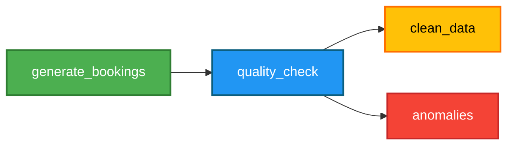

# 🚀 Airflow Data Quality Pipeline

## 📌 Overview

This project demonstrates a production-style data pipeline built using Apache Airflow.

The pipeline generates booking data, validates data quality, and separates:
- ✅ Clean data
- ❌ Anomalies (bad data)

---

## 🧠 Problem Statement

In real-world data engineering, raw data often contains:
- Missing fields
- Invalid values
- Inconsistent formats

If not handled properly, this leads to incorrect analytics and poor business decisions.

---

## ⚙️ Solution

This pipeline introduces a **data quality layer** that ensures only clean and valid data is used downstream.

---

## 🏗️ Pipeline Flow

## 🛠️ Tools Used

- Apache Airflow
- Python
- JSON

---

## 🔍 Key Features

- Automated data pipeline using Airflow DAG
- Data validation for missing and invalid fields
- Separation of clean vs bad data
- Dynamic file partitioning using execution date

---

## 📊 Sample Output

- [Clean Data Sample](sample_output/clean_sample.json)
- [Anomalies Sample](sample_output/anomalies_sample.json)

---

## 🧪 Screenshots

### Airflow DAG (Graph View)

### Successful Pipeline Run

---

## 🔗 Where Spark Fits (Future Extension)

In a real-world pipeline, this system can be extended as:

- Spark handles large-scale data processing
- Airflow orchestrates the workflow
- This project represents the **data validation layer**

---

## 📚 What I Learned

- Building Airflow DAGs
- Task dependencies and orchestration
- Debugging using Airflow logs
- Handling Airflow version changes (`execution_date` → `logical_date`)
- Importance of data quality in pipelines

---

## 🚀 Future Improvements

- Store data in AWS S3
- Integrate Spark (EMR) for processing
- Query results using AWS Athena

---

## 👤 Author

Built as part of my Data Engineering learning journey.

   

